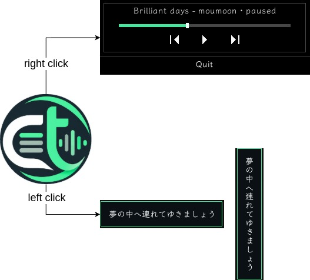

<p align="center">
  
  <br>
  
</p>

<p align="center">
  <a href="README.md">简体中文</a> · <strong>English</strong>
</p>

`ctlyrics` is a terminal lyrics viewer for [cmus](https://cmus.github.io/). It reads the current track and playback position through `cmus-remote -Q`, then displays synchronized LRC lyrics.


tray menu:



web mode:


## Features

- Display synchronized lyrics for the current cmus track in the terminal
- Prefer cmus `title` and `artist` tags, with fallback parsing from `title-artist.ext`
- Match lyrics by music path or by title and artist
- Adjust lyric timing with the arrow keys
- Redraw automatically when the terminal is resized
- Preserve the terminal session after exit without using the alternate screen
- Manage lyric mappings through the built-in web interface
- Upload one or more `.lrc` files by drag and drop
- Reload mapping changes in the terminal automatically
- Search instantly and filter mapped or unmapped tracks
- Load and expand complete lyric previews on demand
- Use light, dark, or system web themes
- Use English or Simplified Chinese in the Web UI, TUI, and CLI
- Show a system tray icon while the TUI runs; its right-click menu displays playback progress, provides media controls, and can quit the application

## Requirements

- Rust 1.88 or newer (Rust 2024 Edition)
- cmus installed and running
- A working `cmus-remote -Q` command
- A graphical browser when using `:web`

Check the cmus connection with:

```bash
cmus-remote -Q
```

## Build

```bash
cargo build
```

For a release build:

```bash
cargo build --release
```

The executables are created at:

```text
target/debug/ctlyrics
target/release/ctlyrics
```

## Usage

### Start the TUI

From the project root:

```bash
./target/debug/ctlyrics
```

Or run it through Cargo:

```bash
cargo run
```

### AppImage

Install the local packaging dependency and build the AppImage with the bundled scripts:

```bash
./package/install-dependencies.sh
./package/build-appimage.sh
```

Artifacts are written to `package/dist/`. The AppImage bundles the three Python tools from `tools/` behind a common entry point:

```bash
./package/dist/ctlyrics-0.1.2-x86_64.AppImage tools get-songs /path/to/music
./package/dist/ctlyrics-0.1.2-x86_64.AppImage tools get-lyrics songs_list.txt
./package/dist/ctlyrics-0.1.2-x86_64.AppImage tools auto-map --help
```

The tools invoke the host's `python3` directly without checking whether it is installed. The host must also provide `cmus` and `cmus-remote`. See [`package/README.md`](package/README.md) for packaging details.

On Linux, the tray prefers StatusNotifierItem for KDE Plasma and Waybar, then falls back to XEmbed on X11 desktops such as AwesomeWM. The right-click menu shows the current song, artist, playback status, and progress, with previous, play/pause, and next controls. The XEmbed progress bar supports click-to-seek, and long song information scrolls automatically. Left-clicking shows or hides an always-above current-lyric bubble; dragging the bubble moves it and preserves its position for the current run. Scrolling over the tray or bubble switches between horizontal display and top-to-bottom vertical display with upright glyphs. Wayland prefers a Layer Shell lyric window, falls back to a regular Wayland window, and uses a system notification only if window initialization fails. GNOME Wayland requires an AppIndicator/KStatusNotifier extension. The lyrics interface continues to work when no tray host is available.

Select the interface language:

```bash
./target/debug/ctlyrics --lang en
./target/debug/ctlyrics --lang zh-CN
./target/debug/ctlyrics --lang auto
```

### Controls

| Key | Action |
|---|---|
| `q` | Quit |
| `Ctrl+C` | Quit safely and restore the terminal state |
| `h` / `?` | Open or close the tree-style help page |
| `Space` | Play / pause |
| `n` | Next track |
| `p` | Previous track |
| `s` | Stop playback |
| `Left` / `Right` | Adjust lyric offset by `-0.1s` / `+0.1s` |
| `Up` / `Down` | Adjust lyric offset by `-0.5s` / `+0.5s` |
| `:` | Enter command mode |
| `Esc` | Leave command mode |
| `:` (in command mode) | Clear the command and return to Normal mode |

The help page presents global controls, help navigation, playback, lyric timing, command mode, commands, and mouse actions as a tree. Scroll line by line with `Up` / `Down` or `j` / `k`, by page with `PageUp` / `PageDown`, jump with `Home` / `End`, or use the mouse wheel. Press `Esc`, `h`, or `?` to return to the lyrics.

The persistent player bar at the bottom shows the title, progress, time, and previous, play/pause, and next icons. All three playback icons support left-click control, and clicking the progress bar seeks directly to the corresponding position. Titles wider than the available area scroll back and forth automatically.

Command output replaces the player bar for one second before the player returns automatically. While entering a command, the same row becomes the `:` input line.

The controls use the Unicode text symbols `⏮︎`, `⏸︎`, `▶︎`, and `⏭︎` without a background color. The TUI uses the font configured by the terminal emulator and cannot load a bundled font itself, so use a terminal font that contains these glyphs for consistent rendering across devices.

### Command Mode

Press `:`, type a command, and press Enter:

| Command | Action |
|---|---|
| `:help` | Open the tree-style help page |
| `:web` | Start and open `http://localhost:3000` immediately |
| `:lang en` | Switch to English and save the preference |
| `:lang zh-CN` | Switch to Simplified Chinese and save the preference |
| `:lang auto` | Follow the system language |

The web server runs in the background of the current `ctlyrics` process.

## Language

Supported languages:

- English (`en`)
- Simplified Chinese (`zh-CN`)

Without an explicit preference, the Web UI uses the browser `Accept-Language` header, while the TUI and CLI use `LC_ALL`, `LC_MESSAGES`, or `LANG`. English is the fallback.

The Web UI stores its language preference in a cookie. The TUI stores it in `config/language` under the current working directory. Translation resources are located at:

```text
locales/en.json
locales/zh-CN.json
```

Every locale must provide the same keys as the English resource.

## Web Themes

The theme selector provides:

- Auto: follow `prefers-color-scheme`
- Light: use the warm paper theme
- Dark: use the charcoal record-library theme

The selected theme is applied immediately and stored in `localStorage.ctlyrics-theme`. Auto mode responds to system theme changes. Theme initialization runs before the first page paint to avoid flashing.

On desktop, the logo, music directory, language, and theme controls share one row. The responsive layout uses a table on desktop and track cards with bottom-sheet dialogs on mobile.

### Start Only the Web Server

```bash
./target/debug/ctlyrics web
```

Use a different port:

```bash
./target/debug/ctlyrics web --port 3001
```

## Configure Lyrics in the Web UI

1. Use `:web` to open the management page.
2. Select Configure or Edit and enter an absolute music directory path.
3. Wait for scanning to complete.
4. Drop `.lrc` files onto the page or select them in the mapping dialog.
5. Select Add mapping next to a track.
6. Choose the matching lyric file and save.

Upload rules:

- Only `.lrc` files are accepted
- Multiple files can be uploaded together
- Each request is limited to 10 MiB
- Files are stored in `lyrics/` under the current working directory
- Uploaded files become available in mapping selectors immediately

The TUI detects changes to `config/mappings.json` and reloads mappings without restarting.

## Matching Order

Lyrics are selected in this order:

1. Match the complete music path returned by cmus
2. Match title and artist
3. Find an `.lrc` filename containing the title in `lyrics/`
4. Use the artist to refine multiple candidates

The Mapped badge only means that a web row has a configured lyric mapping. It does not indicate the track currently playing in cmus.

## LRC Format

Standard time tags are supported:

```text
[00:00.00]Song title
[00:10.70]First line
[01:05.32]Next line
```

Metadata such as `[ti:]`, `[ar:]`, and `[al:]` is not displayed as lyric text.

## Python Tools

The dependency-free scripts under `tools/` generate a local song list and download LRC files.

Get the lyrics from https://www.sq0527.cn/ at the moment.

Generate a list recursively from a music directory:

```bash
python3 tools/get_songs_from_directory.py /path/to/music -o songs_list.txt
```

Supported formats are `.mp3`, `.flac`, `.wav`, `.m4a`, `.ogg`, and `.ape`. Filenames are parsed as `title - artist.ext`. Add `--no-recursive` to scan only the top-level directory.

Download lyrics from the source used by the original Python version:

```bash
python3 tools/get_lyrics.py songs_list.txt -o lyrics
```

Useful options:

```bash
# Select each search result manually
python3 tools/get_lyrics.py songs_list.txt --interactive

# Search and match without writing files
python3 tools/get_lyrics.py songs_list.txt --dry-run

# Replace existing lyrics and slow down requests
python3 tools/get_lyrics.py songs_list.txt --overwrite --delay 1
```

Failures are written to `error.txt`. The third-party website may change or become unavailable. Respect its terms, use a reasonable request interval, and follow applicable copyright law.

Automatically create mappings after downloading lyrics:

```bash
python3 tools/auto_map.py \
  --lyrics-dir ~/warehouse/ctlyrics/lyrics \
  --config-dir ~/warehouse/ctlyrics/config
```

Preview changes first with `--dry-run`. Existing mappings and copied lyrics are preserved by default; `--overwrite` replaces them. Source lyrics are not modified. Matching LRC files are copied into the `lyrics/` directory beside the specified `config/` directory. The original configuration is backed up as `mappings.json.bak` before changes are written.

## Working Directory

Runtime data is relative to the working directory, not the executable location:

```text
config/mappings.json   # Music directory and lyric mappings
config/language        # TUI and CLI language preference
lyrics/                # LRC files
log/                   # Application logs
```

For example:

```bash
cd target/debug
./ctlyrics
```

This uses `target/debug/config/` and `target/debug/lyrics/`. Running `./target/debug/ctlyrics` from the project root uses the root-level `config/` and `lyrics/` instead. Use a consistent working directory.

## Project Layout

```text
src/
  main.rs          Main entry point and TUI event loop
  i18n.rs          Locale detection, translations, and preferences
  player.rs        TUI rendering, input, and commands
  cmus.rs          cmus-remote queries and track parsing
  lyrics_cache.rs  Mapping reload, LRC lookup, and parsing
  mapping.rs       Mapping configuration and music scanning
  web.rs           Web routes, uploads, and mapping API
  logger.rs        Logging setup
templates/
  index.html       Web management page
locales/
  en.json          English resources
  zh-CN.json       Simplified Chinese resources
res/
  logo_icon.png    Application icon
  logo_font.png    Wordmark
tools/
  get_songs_from_directory.py  Generate a song list
  get_lyrics.py                 Search and download LRC files
  auto_map.py                   Create mappings automatically
```

## Development Checks

```bash
cargo build
cargo test i18n::tests
cargo test --no-run
python3 -m unittest discover tools
```
