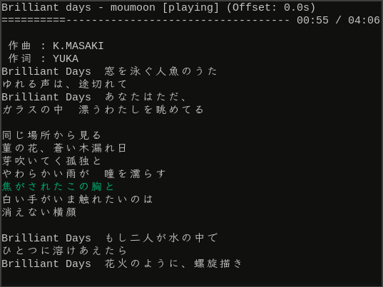
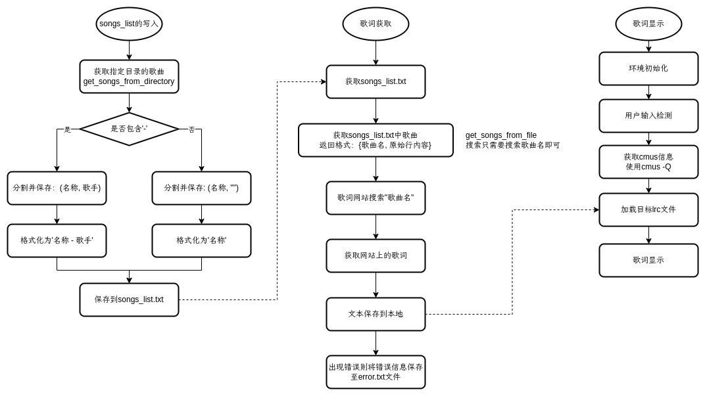

# ctlyrics

cmus terminal lyrics, 终端显示 `cmus` 播放器的歌词



## 主要文件说明

- `get_lyrics.py`: 读取`songs_list.txt`文件，从无损音乐网获取歌词`.lrc`文件
- `get_songs_from_directory.py`: 从本地文件中生成`songs_list.txt`文件
- `ctlyrics.py`: 歌词显示主程序文件



## 原理

使用`cmus-remote -Q`查询当前音乐状态，查找对应的歌词进行时间轴匹配

## 使用

如果只是显示歌词：

```bash
python ctlyrics.py
```

- `q`: 退出歌词显示
- `↑`: 歌词显示减慢 0.5s
- `↓`: 歌词显示加快 0.5s
- `←`: 歌词显示减慢 0.1s
- `→`: 歌词显示加快 0.1s

如果需要使用 ctlyrics 提供的歌词下载（通过[无损音乐网](https://www.sq0527.cn/)下载），则需要安装相关依赖

```bash
pip install -r requirements.txt
```
