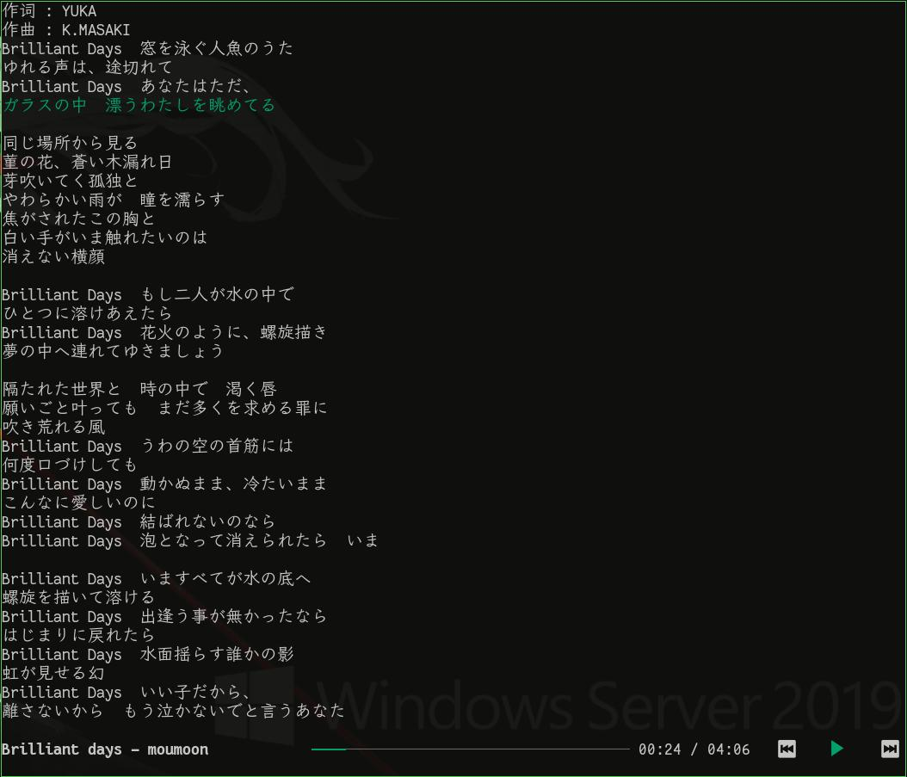
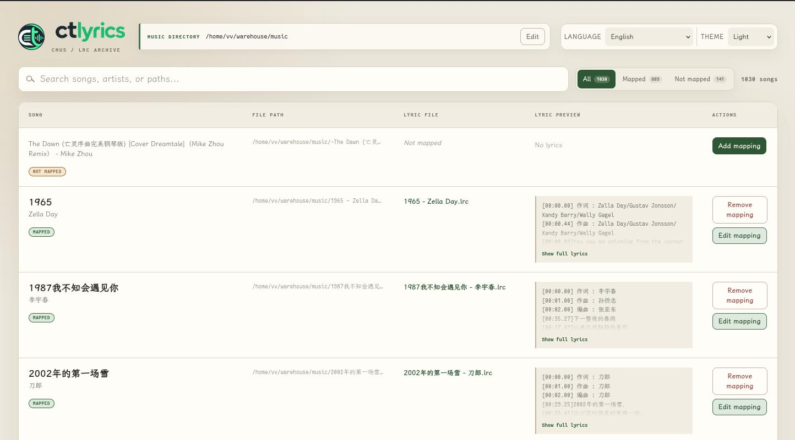
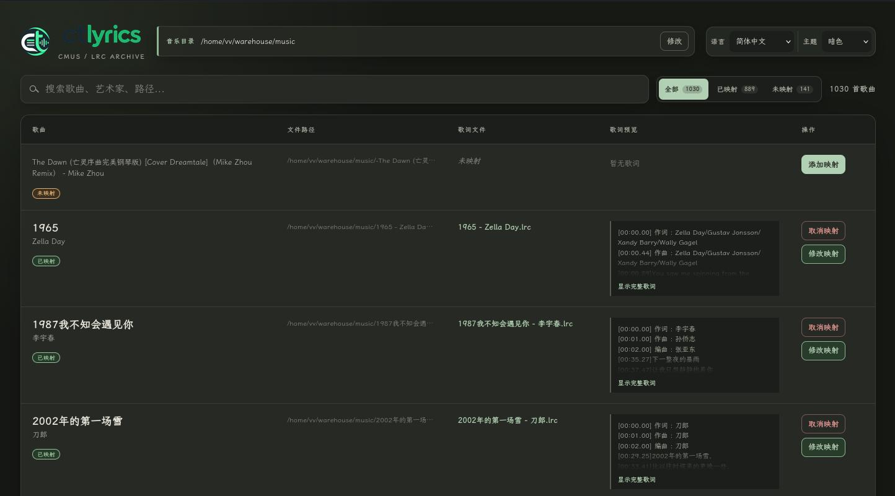

<p align="center">
  
  <br>
  
</p>

<p align="center">
  <strong>简体中文</strong> · <a href="README.en.md">English</a>
</p>

`ctlyrics` 是一个配合 [cmus](https://cmus.github.io/) 使用的终端歌词显示程序。它通过 `cmus-remote -Q` 获取当前歌曲和播放进度，读取 LRC 文件并同步显示歌词。



web 模式：





## 功能

- 在终端中同步显示 cmus 当前歌曲歌词
- 优先读取 cmus 的 `title`、`artist` 标签，并支持从 `歌曲名-歌手.ext` 文件名回退解析
- 支持按音乐文件路径或标题、歌手匹配歌词
- 支持使用方向键调整歌词时间偏移
- 支持终端窗口缩放并自动重新绘制
- 不使用备用屏幕，退出后保留当前终端会话
- 内置歌词映射管理网页
- 网页支持拖拽上传一个或多个 `.lrc` 文件
- 网页保存音乐目录时显示加载进度
- 网页修改映射后，终端自动重新加载映射配置
- 网页统计并筛选已映射、未映射歌曲，筛选可与即时搜索组合使用
- 歌词预览支持按需加载并展开完整歌词
- Web 支持亮色、暗色和跟随系统主题
- 支持英文和简体中文，可在 Web、TUI 和 CLI 中切换
- TUI 运行时显示系统托盘图标，可通过右键菜单关闭程序

## 环境要求

- Rust 1.88 或更高版本（项目使用 Rust 2024 Edition）
- 已安装并运行 `cmus`
- `cmus-remote -Q` 能够正常返回当前歌曲信息
- 使用 `:web` 时需要可用的图形浏览器

可以先检查 cmus 状态：

```bash
cmus-remote -Q
```

## 构建

```bash
cargo build
```

发布构建：

```bash
cargo build --release
```

生成的主程序位于：

```text
target/debug/ctlyrics
target/release/ctlyrics
```

## 使用

### 启动歌词界面

在项目根目录运行：

```bash
./target/debug/ctlyrics
```

也可以直接使用 Cargo：

```bash
cargo run
```

### AppImage

使用仓库内脚本安装本地打包依赖并生成 AppImage：

```bash
./package/install-dependencies.sh
./package/build-appimage.sh
```

产物保存在 `package/dist/`。AppImage 内置 `tools/` 下的三个 Python 工具，可通过统一入口调用：

```bash
./package/dist/ctlyrics-0.1.2-x86_64.AppImage tools get-songs /path/to/music
./package/dist/ctlyrics-0.1.2-x86_64.AppImage tools get-lyrics songs_list.txt
./package/dist/ctlyrics-0.1.2-x86_64.AppImage tools auto-map --help
```

Python 工具直接调用宿主系统的 `python3`，不会预先检查是否安装。`cmus` 和 `cmus-remote` 也由宿主系统提供。详细打包说明见 [`package/README.md`](package/README.md)。

Linux 托盘优先使用 StatusNotifierItem，兼容 KDE Plasma 和启用 `tray` 模块的 Waybar；AwesomeWM 等 X11 环境自动回退到 XEmbed。GNOME Wayland 需要安装 AppIndicator/KStatusNotifier 扩展。托盘不可用时歌词界面仍可正常运行。

指定界面语言：

```bash
./target/debug/ctlyrics --lang en
./target/debug/ctlyrics --lang zh-CN
./target/debug/ctlyrics --lang auto
```

### 控制键

| 按键 | 功能 |
|---|---|
| `q` | 退出程序 |
| `Ctrl+C` | 安全退出并恢复终端状态 |
| `h` / `?` | 打开或关闭树状帮助页 |
| `空格` | 播放 / 暂停 |
| `n` | 下一首 |
| `p` | 上一首 |
| `s` | 停止播放 |
| `←` / `→` | 歌词时间偏移 `-0.1s` / `+0.1s` |
| `↑` / `↓` | 歌词时间偏移 `-0.5s` / `+0.5s` |
| `:` | 进入命令模式 |
| `Esc` | 退出命令模式 |
| `:`（命令模式中） | 清空命令并返回 Normal 模式 |

帮助页按全局、帮助页导航、播放控制、歌词时间、命令模式、命令和鼠标操作显示树状说明。使用 `↑` / `↓` 或 `j` / `k` 逐行滚动，`PageUp` / `PageDown` 翻页，`Home` / `End` 跳转到首尾，鼠标滚轮也可滚动。按 `Esc`、`h` 或 `?` 返回歌词界面。

TUI 底部常驻显示歌曲标题、播放进度、时间以及上一首、播放/暂停、下一首图标。三个播放图标均可使用鼠标左键点击，点击进度条可直接跳转到对应播放位置。超出可用宽度的歌曲标题会自动左右往返滚动。

执行命令后，命令输出会在底栏显示 1 秒，然后自动恢复播放器。进入命令模式时播放器底栏临时切换为 `:` 输入行。

播放器图标使用 Unicode 文本字符 `⏮︎`、`⏸︎`、`▶︎`、`⏭︎`，不设置背景色。TUI 使用终端自身配置的字体，程序无法主动加载仓库内字体；跨设备使用时应选择包含这些字符的终端字体。

### 命令模式

在歌词界面按 `:`，输入命令后按回车：

| 命令 | 功能 |
|---|---|
| `:help` | 打开树状帮助页 |
| `:web` | 即时启动 `http://localhost:3000` 并使用默认浏览器打开 |
| `:lang en` | 切换为英文并保存设置 |
| `:lang zh-CN` | 切换为简体中文并保存设置 |
| `:lang auto` | 清除语言设置并跟随系统语言 |

Web 服务在当前 `ctlyrics` 进程内后台运行，不需要提前单独启动。

## 语言设置

目前支持：

- English (`en`)
- 简体中文 (`zh-CN`)

未手动选择语言时：

- Web 根据浏览器的 `Accept-Language` 自动选择
- TUI 和 CLI 根据 `LC_ALL`、`LC_MESSAGES`、`LANG` 自动选择
- 无法识别时回退到英文

网页右上角可以选择自动、English 或简体中文，选择结果保存在浏览器 Cookie 中。TUI 使用 `:lang` 命令切换，选择结果保存在当前工作目录的 `config/language` 中。

语言文本集中存放于：

```text
locales/en.json
locales/zh-CN.json
```

新增语言时应提供与英文资源完全一致的翻译键。

## Web 主题

网页顶部工具栏使用下拉框提供三种主题模式：

- 自动：跟随浏览器的 `prefers-color-scheme`
- 亮色：使用暖白纸张风格
- 暗色：使用炭黑唱片库风格

主题切换即时生效并保存在浏览器的 `localStorage.ctlyrics-theme` 中。自动模式下，系统主题变化时网页会同步切换。主题初始化在页面绘制前完成，避免刷新时出现亮暗闪烁。

桌面端将 ctlyrics 标识、音乐目录配置、语言和主题放在同一行；窄屏设备会根据可用宽度自动换行。

页面针对桌面、平板和手机进行了响应式处理：桌面使用曲目表格，手机宽度下自动切换为歌曲卡片和底部模态面板。

### 单独启动 Web 服务

也可以不启动 TUI，单独运行配置网页：

```bash
./target/debug/ctlyrics web
```

指定端口：

```bash
./target/debug/ctlyrics web --port 3001
```

## 网页配置歌词

1. 使用 `:web` 打开配置页面。
2. 点击“去设置”或“修改”，填写音乐目录的绝对路径。
3. 保存后等待顶部进度条结束，页面会列出扫描到的音乐文件。
4. 将 `.lrc` 文件拖入网页任意位置，或者在映射窗口中点击上传区域选择文件。
5. 点击歌曲旁的“添加映射”。
6. 选择对应的歌词文件并保存。

上传规则：

- 仅允许 `.lrc` 文件
- 支持同时上传多个文件
- 单次请求最大 10 MiB
- 上传结果保存在当前工作目录的 `lyrics/` 中
- 上传完成后，歌词文件会立即加入映射下拉列表

映射保存后，正在运行的 TUI 会检测 `config/mappings.json` 的变化并重新加载，不需要重新启动程序。

## 歌词匹配顺序

程序按以下顺序查找歌词：

1. 使用 cmus 返回的音乐文件完整路径查找映射
2. 使用标题和歌手查找映射
3. 在 `lyrics/` 中查找文件名包含歌曲标题的 `.lrc` 文件
4. 如果有多个候选文件，再使用歌手名称筛选

网页中显示“已映射”只代表该行歌曲已配置歌词，不代表 cmus 当前正在播放这首歌曲。可以使用下面的命令确认当前歌曲：

```bash
cmus-remote -Q
```

## LRC 格式

支持标准时间标签：

```text
[00:00.00]歌曲名称
[00:10.70]第一句歌词
[01:05.32]下一句歌词
```

`[ti:]`、`[ar:]`、`[al:]` 等元数据不会显示为歌词。

## 歌词下载工具

`tools/` 本地歌曲列表生成和歌词下载工具。脚本只使用 Python 标准库，不需要额外安装依赖。

当前从 https://www.sq0527.cn/ 获取歌词。

先从音乐目录生成列表：

```bash
python3 tools/get_songs_from_directory.py /path/to/music -o songs_list.txt
```

脚本默认递归扫描 `.mp3`、`.flac`、`.wav`、`.m4a`、`.ogg` 和 `.ape`，并按 `歌曲名 - 歌手.ext` 解析文件名。只扫描目录第一层时使用 `--no-recursive`。

再从原版本使用的 `sq0527.cn` 搜索并下载 LRC：

```bash
python3 tools/get_lyrics.py songs_list.txt -o lyrics
```

下载器默认按标题和歌手相关度选择结果、跳过已有文件，并在请求失败时重试。常用选项：

```bash
# 手动选择每首歌的搜索结果
python3 tools/get_lyrics.py songs_list.txt --interactive

# 仅测试搜索和匹配，不写入歌词
python3 tools/get_lyrics.py songs_list.txt --dry-run

# 覆盖已有歌词并调整请求间隔
python3 tools/get_lyrics.py songs_list.txt --overwrite --delay 1
```

失败项写入 `error.txt`。网站结构或可用性由第三方维护，批量下载时请控制请求频率并遵守网站条款及当地版权规定。

歌词下载完成后，可以自动写入 ctlyrics 映射。配置目录中需要已有 `mappings.json` 和有效的 `music_dir`：

```bash
python3 tools/auto_map.py \
  --lyrics-dir ~/warehouse/ctlyrics/lyrics \
  --config-dir ~/warehouse/ctlyrics/config
```

建议先预览匹配结果：

```bash
python3 tools/auto_map.py \
  --lyrics-dir ~/warehouse/ctlyrics/lyrics \
  --config-dir ~/warehouse/ctlyrics/config \
  --dry-run
```

自动映射默认保留已有手动映射，只写入高置信度且无歧义的匹配。工具不会移动或修改 `--lyrics-dir` 中的源文件，而是将目标歌词复制到配置目录同级的 `lyrics/`，例如指定 `/opt/ctlyrics/config` 时复制到 `/opt/ctlyrics/lyrics`。这与 ctlyrics 固定从运行目录下 `lyrics/` 读取的规则一致。使用 `--overwrite` 可更新已有映射并覆盖目标歌词；使用 `--music-dir /path/to/music` 可覆盖配置中的音乐目录。实际写入前，原配置会备份为 `mappings.json.bak`。修改外部配置后需要重启 Web 服务。

## 工作目录

所有运行数据都相对于启动程序时的当前工作目录，而不是可执行文件所在目录：

```text
config/mappings.json   # 音乐目录和歌词映射
config/language        # TUI 和 CLI 语言设置
lyrics/                # LRC 歌词目录
log/                   # 程序日志
```

例如：

```bash
cd target/debug
./ctlyrics
```

此时程序使用 `target/debug/config/` 和 `target/debug/lyrics/`。

如果在项目根目录运行：

```bash
./target/debug/ctlyrics
```

则程序使用项目根目录下的 `config/` 和 `lyrics/`。建议固定在同一目录启动，避免读取到不同的配置和歌词。

## 项目结构

```text
src/
  main.rs          主程序入口和 TUI 事件循环
  i18n.rs          语言检测、翻译加载和偏好设置
  player.rs        TUI 渲染、输入和命令处理
  cmus.rs          cmus-remote 查询与歌曲信息解析
  lyrics_cache.rs  映射刷新、LRC 查找和解析
  mapping.rs       映射配置读写
  web.rs           Web 路由、上传和映射接口
  logger.rs        日志初始化
templates/
  index.html       Web 管理页面
locales/
  en.json          英文语言资源
  zh-CN.json       简体中文语言资源
res/
  logo_icon.png    应用图标
  logo_font.png    品牌字标
tools/
  get_songs_from_directory.py  从音乐目录生成歌曲列表
  get_lyrics.py                 搜索并下载 LRC 歌词
  auto_map.py                   自动生成歌曲与歌词映射
```

## 开发验证

```bash
cargo build
cargo test i18n::tests
cargo test --no-run
python3 -m unittest discover tools
```
